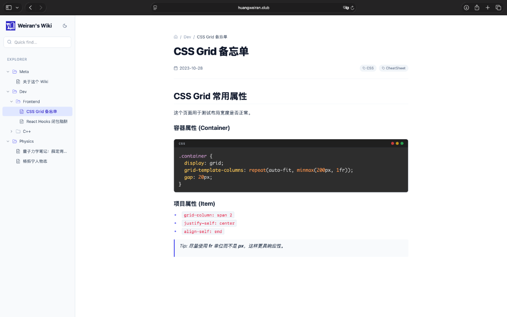
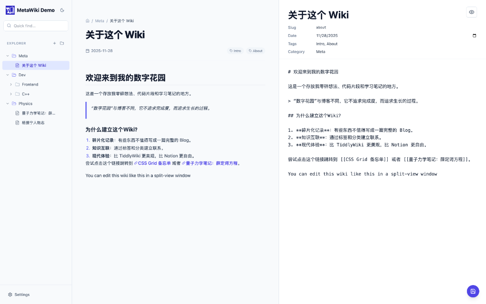

<div align="center">
  
  <h1>RectoWiki</h1>
  <p>
    <b>A modern, personal wiki application built with React, Vite, and Electron.</b>
  </p>
  <p>
    <a href="https://github.com/EtoDemerzel0427/RectoWiki/releases">
      
    </a>
  </p>
  <p>
    <b>Latest Release: v0.3.0 is out!</b> <a href="https://github.com/EtoDemerzel0427/RectoWiki/releases">Download for macOS/Windows/Linux</a>
  </p>
  <p>
    
    
  </p>
</div>

**RectoWiki** offers the best of both worlds: a **Static Web Wiki** for hosting your knowledge online, and a **Native Desktop App** for offline editing and management.

Built with React, Vite, and Electron, it seamlessly bridges the gap between a public digital garden and a private, local-first note-taking tool.

## Features

- **Markdown Support**: Write content in standard Markdown.
- **Math Equations**: LaTeX support via KaTeX (`$E=mc^2$`).
- **Code Highlighting**: Syntax highlighting for code blocks.
- **Wiki Links**: Internal linking using `[[Wiki Link]]` syntax.
- **Clean URLs**: Path-based routing (e.g., `/Category/Page`).
- **Responsive Design**: Mobile-friendly with a collapsible sidebar.
- **Dark Mode**: Toggle between light and dark themes.
- **Search & Filtering**: Real-time search and tag filtering.
- **File-Based**: Content is generated from a local folder structure.

## Project Structure

```
recto-wiki/
├── content/           # Your Markdown files (the wiki content)
├── public/            # Static assets
│   ├── content.json   # Generated content index (for dev/web)
│   └── logo.png       # Application logo
├── scripts/           # Build scripts
│   └── generate-content.js # Script to parse markdown and generate JSON
├── electron/          # Electron main process code
│   ├── main.cjs       # Main process entry point
│   ├── preload.cjs    # Preload script
│   └── contentManager.mjs # Content indexing and watching logic
├── src/               # React source code
├── index.html         # Entry point
├── vite.config.js     # Vite configuration
└── package.json       # Dependencies and scripts
```

## Getting Started

### Prerequisites

- Node.js (v18 or higher)
- npm (v9 or higher)

### Installation

1.  Clone the repository:
    ```bash
    git clone https://github.com/yourusername/recto-wiki.git
    cd recto-wiki
    ```

2.  Install dependencies:
    ```bash
    npm install
    ```

### Local Development

1.  Start the development server:
    ```bash
    npm run dev
    ```
    The app will be available at `http://localhost:5173/`.

2.  **Adding Content**:
    - Create `.md` files in the `content/` directory.
    - You can use subdirectories to create categories (e.g., `content/Physics/Quantum.md`).
    - Add frontmatter to your markdown files for metadata:
      ```markdown
      ---
      title: My Note Title
      date: 2023-10-27
      tags: [tag1, tag2]
      ---
      ```

3.  **Updating Content**:
    - **Web Mode**: Run `npm run gen-content` to update `content.json`.
    - **Electron Mode**: Content is updated **automatically in real-time** as you save files!

## Desktop App (Electron)

This project provides a robust desktop application wrapper built with Electron.


### Features

- **Real-Time Updates**: Edits to markdown files are reflected instantly in the app.
- **Custom Content Location**: Choose any folder on your computer to serve as your wiki.
- **Local File System**: Directly edit files on your hard drive.
- **Native Menus**: Context menus for file operations (rename, delete, etc.).
- **Offline Capable**: Works without an internet connection.

### Running the Desktop App

1.  Start the development version:
    ```bash
    npm run electron:dev
    ```

2.  Build for production (Mac/Windows/Linux):
    ```bash
    npm run electron:build
    ```
    The executable will be in the `dist_electron/` folder.

    > **Note for macOS Users:**
    > If you see a "damaged" error when opening the app, run this command in your terminal to bypass Gatekeeper:
    > ```bash
    > xattr -cr /Applications/RectoWiki.app
    > ```

## Testing

We use `vitest` for unit testing. The test suite covers the Content Manager, File System utilities, and Build Scripts.

Run all tests with:
```bash
npm test
```

## Publishing to the Web
 
 If you are using the Desktop App and want to publish your notes as a website (like this one), follow these steps:
 
 1.  **Get the Web Engine**:
     - Fork and clone this repository to your computer.
 
 2.  **Connect the App**:
     - Open the Desktop App settings.
     - In "Content Location", click **Browse** and select the `content` folder inside your cloned repository.
     - Now, anything you write in the App is saved directly to your repository!
 
 3.  **Deploy**:
     - **GitHub Pages**: Go to your repository Settings -> Pages, select "GitHub Actions" as the source. Then push your changes to the `main` branch.
     - **Netlify/Vercel**: Connect your repository and use `npm run build` as the build command and `dist` as the output directory.

## Customization

- **Logo**: Replace `public/logo.png` with your own image.
- **Styles**: Edit `src/index.css` or `tailwind.config.js` to customize the look and feel.

## License

MIT
